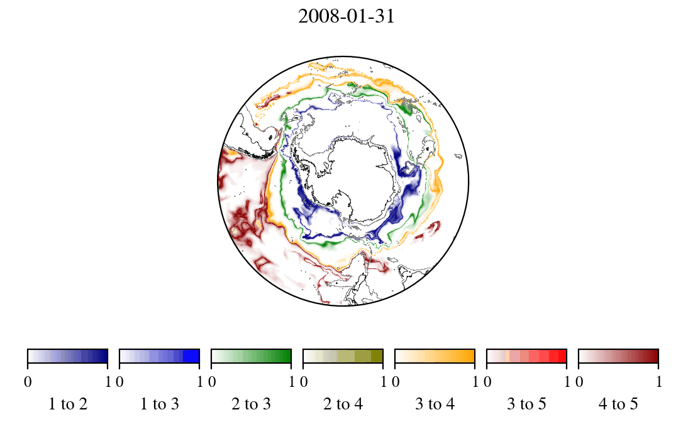

# Defining Southern Ocean fronts using unsupervised classification

 [](https://opensource.org/licenses/MIT)
  <a href=https://www.python.org/downloads/release/python-388/></a>
 <a href="https://github.com/psf/black"></a>
 
 <a href=https://zenodo.org/badge/latestdoi/318541083></a>

## Paper: https://doi.org/10.5194/os-2021-40

## Short description

In the Southern Ocean, fronts delineate water masses, which correspond to upwelling
and downwelling branches of the overturning circulation. Classically, oceanographers
define Southern Ocean fronts as a small number of continuous linear features that
encircle Antarctica. However, modern observational and theoretical developments are
challenging this traditional framework to accommodate more localized views of fronts
[Chapman et al. 2020].

Here we present code for implementing two related methods for calculating fronts from
oceanographic data. The first method uses unsupervised classification (specifically,
Gaussian Mixture Modeling or GMM) and a novel interclass metric to define fronts.
This approach produces a discontinuous, probabilistic view of front location,
emphasising the fact that the boundaries between water masses are not uniformly sharp
across the entire Southern Ocean.

The second method uses Sobel edge detection to highlight rapid changes [Hjelmervik & Hjelmervik, 2019].
This approach produces a more local view of fronts, with the advantage that it can highlight the movement
of individual eddy-like features (such as the Agulhas rings).

1. Chapman, C. C., Lea, M.-A., Meyer, A., Sallee, J.-B. & Hindell, M.
    Defining Southern Ocean fronts and their influence on biological and
    physical processes in a changing climate. Nature Climate Change (2020).
    https://doi.org/10.1038/s41558-020-0705-4

2. Maze, G. et al. Coherent heat patterns revealed by unsupervised
    classification of Argo temperature profiles in the North Atlantic Ocean.
    Progress in Oceanography (2017).
    https://doi.org/10.1016/j.pocean.2016.12.008,
    https://doi.org/10.5281/zenodo.3906236

3. Hjelmervik, K. B. & Hjelmervik, K. T. Detection of oceanographic fronts
    on variable water depths using empirical orthogonal functions.
    IEEE Journal of Oceanic Engineering (2019).
    https://doi.org/10.1109/JOE.2019.2917456

## I metric for K=5




## Getting started

- Make the environment:

    ```bash
    make env
    ```

- Activate the environment in conda:

     ```bash
     conda activate ./env
     ```

- Change the settings in `src.constants` to set download location etc.

- Download data (`get_zip`  1694.64639 s):

   ```bash
   python3 src/data_loading/bsose_download.py
   ```

- Make I-metric:

   ```bash
   python3 src/models/batch_i_metric.py
   ```

- Make figures:
   ```bash
   python3 main.py
   ```

## Project Organization

```txt
├── LICENSE
├── Makefile           <- Makefile with commands like `make env` or `make `
├── README.md          <- The top-level README for developers using this project.
├── main.py            <- The top-level README for developers using this project.
|
├── figures            <- .png images.
│
├── requirements       <- Directory containing the requirement files.
│
├── setup.py           <- makes project pip installable (pip install -e .) so src can be imported
|
├── src                <- Source code for use in this project.
|   |
│   ├── __init__.py    <- Makes src a Python module
|   |
│   ├── data           <- KO fronts to plot.
│   │
│   ├── data_loading   <- Scripts to download and name data.
│   │
│   ├── models         <- Make I metric, Sobel edge detection.
│   │
│   ├── plot           <- plotting
|   |
│   ├── plot_utils      <- plotting utilities
|   |
│   ├── preprocessing   <- preprocessing scripts (to transform to density etc).
|   |
|   ├──  tests          <- Scripts for unit tests of your functions
|   | 
|   ├── animate.py       <- animate i-metric.
|   ├── constants.py     <- constains majority of run parameters that can be changed.
|   ├── make_figures.py  <- make figures in one long script.
|   ├── move_figures.py  <- move figures script (unnecessary).
|   └── time_wrapper.py  <- time wrapper to time parts of the program.
│
└── setup.cfg          <- setup configuration file for linting rules
```

## Requirements

- Anaconda, with `conda` working in shell.
- `make` in shell.
- Python 3.6+ (final run for paper used `python==3.8.8`)

---

Project template created by the
[Cambridge AI4ER Cookiecutter](https://github.com/ai4er-cdt/ai4er-cookiecutter).
