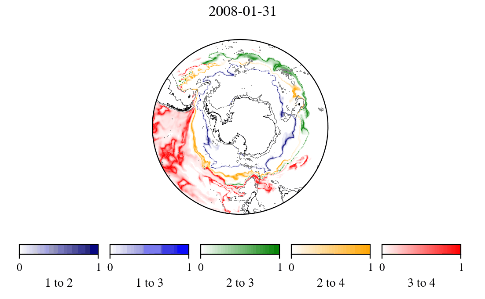
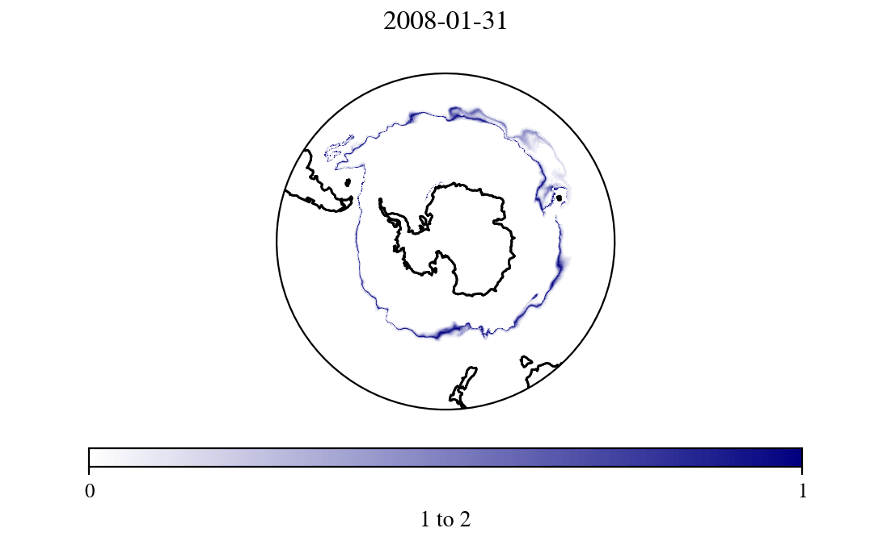

# Animations gallery

Animations of the I-metric for the full time period of BSOSE-i106.
Choosing different `K` values, the initial period includes the spin-up
of the reanalysis product, and so is not typical of the full period.

## I metric for K=5

## I metric for K=4

## I metric for K=2

